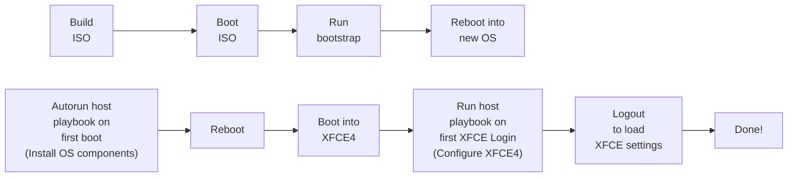

# iac

Infrastructure as Code.

This project installs and configures Arch Linux, Debian or Ubuntu operating systems fully automated.

> ⚠ Make sure to create a `.env` file and reference to the correct code branch with the env vars in it!

Features:

- 💿 Build the installer ISO image in a Docker environment
- 💡 Read hostname and OS type from UEFI variables or use cloud-init
- 🔨 Install a minimal Arch Linux OS, Debian OS or Ubuntu OS
- ❓ Decide target disk for installation, etc by hostname
- 🔐 Setup root password, SSH keys and user accounts
- 🚀 Autostart OS configuration at first boot
- 💻 Autostart Desktop configuration at first Desktop logon
- ⏱ From blank disk to booted system in ~10 Minutes

Workflow base installation & hostname based configuration:



## Architecture

All packages are installed from the official sources.

- bash
- systemd
- systemd-networkd (DHCP on all ens* interfaces)
- systemd-timesyncd
- systemd-resolved
- net-tools + dnsutils
- nano + vim
- curl + wget
- Ansible

| OS                   | #Packages | #Processes | Size  | Memory |
|----------------------|-----------|------------|-------|--------|
| Ubuntu 24.04 "Noble" |      ~390 |         14 | 2.5GB |  280MB |
| Debian 12 "Bookworm" |      ~390 |         14 | 2.2GB |  270MB |
| Arch Linux           |      ~170 |         20 | 2.7GB |  300MB |

## archiso

[Archiso](https://wiki.archlinux.org/title/archiso) is used as a base for the Installer ISO. 
[archiso/](./archiso/) contains a Dockerfile and some scripts to build a custom Arch Linux installer 
ISO with additional scripts.

- `./archiso/build.sh` builds the container image
- `./archiso/pack.sh` runs the container image to build the Arch Linux ISO image
- ISO Image can be found in `./archiso/output/`

Requires Docker CE, `pack.sh` executes a container **in privileged mode**.

## Automatic configuration with Cloud-Init

TODO

## Automatic hostname detection with UEFI varables

The `perrys-bootstrapper.sh` script is using UEFI variables to fetch the hostname from the system and use the
correct ansible inventory variables.

Set hostname in UEFI variable:

```sh
echo -n myhostname > efi-hostname
efivar --name ed38a5bf-1135-4b0f-aa72-49d30b05dfd4-PerryHostname -w -f efi-hostname
```

Get the hostname from UEFI variable:

```sh
cat /sys/firmware/efi/efivars/PerryHostname-ed38a5bf-1135-4b0f-aa72-49d30b05dfd4
```

In addition the variable `PerryFlavor-ed38a5bf-1135-4b0f-aa72-49d30b05dfd4` can be used to
set the flavor (`debian` or `archlinux`).

## How to install a OS

- Build the Arch Linux ISO image
- Boot ISO in a virtual machine or on a physical system
- Ensure that the `diskdev` and `bootmode` are correct in the [inventoy](./inventory/defaults.yml)
- Run installer
    - Debian: `perrys-bootstrapper.sh --flavor debian`
    - Arch Linux: `perrys-bootstrapper.sh --flavor archlinux`
- Reboot into the new OS

## Configure Arch Linux OS

Run `perrys-ansible-apply.sh` as root.

It pulls automatically the correct playbook from this repo by the hostname of the operating system.

## TODO

- [x] Bluetooth
- [x] NetworkManager
- [x] NFTables
- [x] Pulseaudio
- [x] Swap File
- [x] Unix Account
- [x] X11
- [x] XFCE
- [x] Self-Signed certificate for localhost
- [x] NGINX with tilde user dirs
- [ ] SSH Daemon config
- [ ] Disk Encryption
